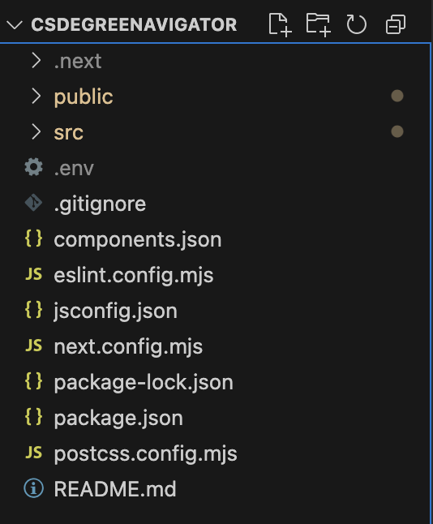
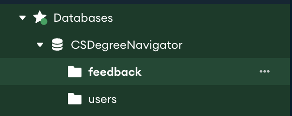

# CSDegreeNavigator

## Overview

This project, developed for Dr. Linh Ngo, helps West Chester University CS students visualize their progress toward graduation. It includes a degree progression chart, schedule customization to avoid conflicts, and real-time updates with WCUPA’s semester schedule API.

## Group Members

- **Muhammad Amer (Project Manager - Assisted Frontend/Backend)**
- **Justin Kerr (Backend)**
- **Robert Silver (Backend)**
- **Tobyn Sitar (Frontend)**
- **Drew Stephens (Backend)**
- **Yanxi Wei (Frontend)**

# Features

- **Degree Progression Visualization**: Track completed, in-progress, and pending courses.
- **Schedule Customization**: Select courses and block unavailable hours.
- **Real-Time Updates**: Automatically syncs with WCUPA’s semester schedule.

# Frameworks

- **NextJS**: Using for frontend and uses ShadCN components.
- **NextAuth/JWT**: Used for accounts and managing user session.
- **MongoDB**: Used with API routes and fetching/storing data.

# Project Setup

This is a [Next.js](https://nextjs.org) project bootstrapped with [`create-next-app`](https://github.com/vercel/next.js/tree/canary/packages/create-next-app).

1.  **Clone the Repository:**  
    First, clone the repository to your local machine:  
    **Note:** If you haven't set up your SSH key with GitHub yet, or if you don't have access, please send your public SSH key to the repo maintainer (Tobyn Sitar) so it can be added to the repo.
    
    ```bash
    git clone https://github.com/Tobyn-Sitar/CSDegreeNavigator.git
    ```
    
2.  **Add .env file to root directory**
    
    ```bash
    MONGODB_URI=mongodb://localhost:27017/CSDegreeNavigator
    NEXTAUTH_SECRET=asdsadasdasdsadsadsadsadsadsadsads
    NEXTAUTH_URL=http://localhost:3000/
    ```

    
    
3.  **Make sure you have database setup like this**  
    ****
    
4.  **Install Dependencies:**  
    Navigate into the project directory and install the required packages:
    
    ```bash
    cd CSDegreeNavigator
    npm install
    ```
    
5.  **Open the Project:**  
    Open the project folder in Visual Studio Code or your preferred code editor or IDE.
    
6.  **Run the Development Server:**  
    Once you're in the project directory, start the Next.js development server using one of the following commands:
    
    ```bash
    npm run dev
    ```
    
    &nbsp;
    

Open http://localhost:3000 with your browser to see the result.

You can start editing the page by modifying `app/page.js`. The page auto-updates as you edit the file.

This project uses [`next/font`](https://nextjs.org/docs/app/building-your-application/optimizing/fonts) to automatically optimize and load [Geist](https://vercel.com/font), a new font family for Vercel.

## Learn More

To learn more about Next.js, take a look at the following resources:

- [Next.js Documentation](https://nextjs.org/docs) - learn about Next.js features and API.
- [Learn Next.js](https://nextjs.org/learn) - an interactive Next.js tutorial.

You can check out [the Next.js GitHub repository](https://github.com/vercel/next.js) - your feedback and contributions are welcome!

&nbsp;

&nbsp;

# Credits

Next-Auth Setup - GTCoding [(Youtube)](https://www.youtube.com/watch?v=PEMfsqZ2-As) [(Github)](https://github.com/Godsont/auth-with-credentials)
Settings Page - quadraplex214 [(v0.dev)](https://v0.dev/t/Zibpj5vjrG5)